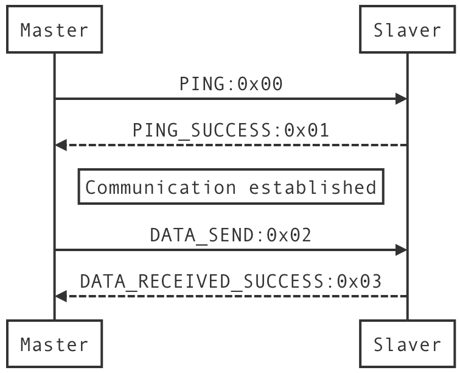
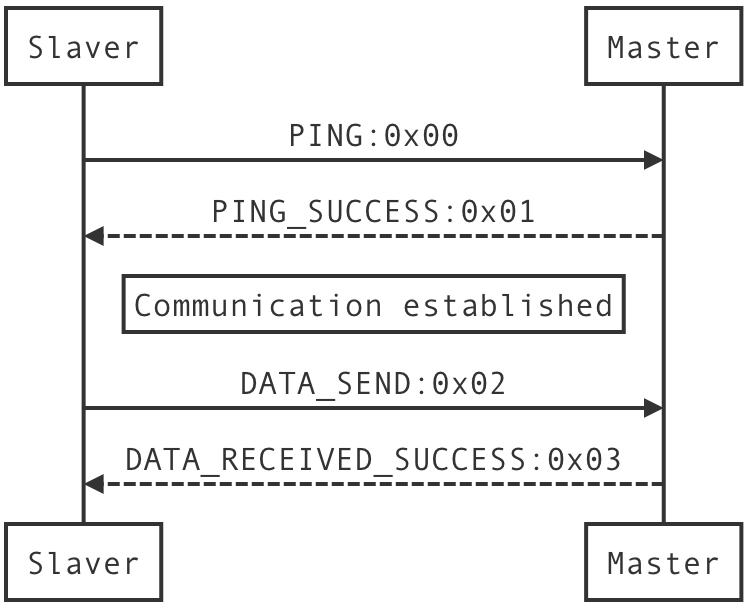

# EMQX LoraWan-Gateway
EMQX lorawan gateway plugin.

## Quick start
Just add this plugin to your emqx, and run on hardware which support UART communication.

## Plugin config

- Serial baud rate, default 115200
- Data bits, default 8
- Data stop bits, default 1
- Data party, default none
- Serial flowv control, default none

```ini
##
## Serial baud rate, default 115200
##
emqx_lorawan_gateway.uart.1.baud_rate = 115200

##
## Data bits, default 8
##
emqx_lorawan_gateway.uart.1.data_bits = 8

##
## Data stop bits, default 1
##
emqx_lorawan_gateway.uart.1.stop_bits = 1

##
## Data party, default none
##
emqx_lorawan_gateway.uart.1.data_party = none

##
## Serial flowv control, default none
##
emqx_lorawan_gateway.uart.1.flow_control = none

##
## Local tty file description handler
##
emqx_lorawan_gateway.uart.1.device = /dev/ttys009

##
## Data send buffer(byte)
##
emqx_lorawan_gateway.uart.1.send_buffer = 128

##
## Data send timeout(ms)
##
emqx_lorawan_gateway.uart.1.send_timeout = 1000

##
## Data recive buffer(byte)
##
emqx_lorawan_gateway.uart.1.receive_buffer = 128

##
## Data recive timeout(ms)
##
emqx_lorawan_gateway.uart.1.receive_timeout = 1000

```

## Protocol specific
Protocol packet use ***4 byte*** fixed header and data body is fixed buffer size where can configured in EMQX or your UART device.

| Code (1 Byte) | Body                                                | Name                  |
| ------------- | --------------------------------------------------- | --------------------- |
| 0x00          | [MSGID:2, Type:1]                                   | PING                  |
| 0x01          | [MSGID:2, Type:1]                                   | PING SUCCESS          |
| 0x02          | [MSGID:2, Type:1 \| Length:2 \| Data:0-65535 Byte ] | DATA SEND             |
| 0x03          | [MSGID:2, Type:1]                                   | DATA RECEIVED SUCCESS |
| 0x04          | [MSGID:2, Type:1]                                   | UNKNOWN PACKET        |
| 0x05          | [MSGID:2, Type:1]                                   | ERROR                 |

### Master to Slaver
The following flowchart is for master to slaver communication:


### Slaver to Master
The following flowchart is for slaver to master communication:


## Community
- QQ Group: 475512169
- HomePage1: http://openlab.ezlinker.cn
- HomePage2: http://wwhai.gitee.io
- Email: cnwwhai@gmail.com

## License
MIT
## Author
- wwhai
